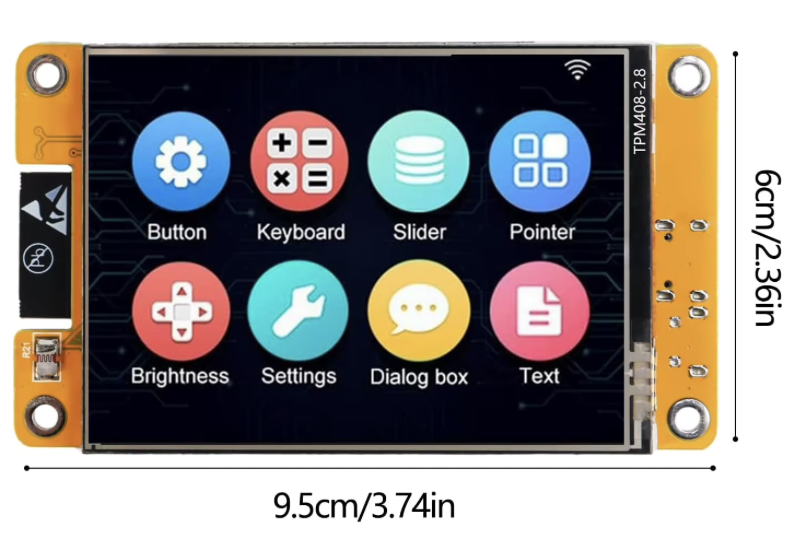
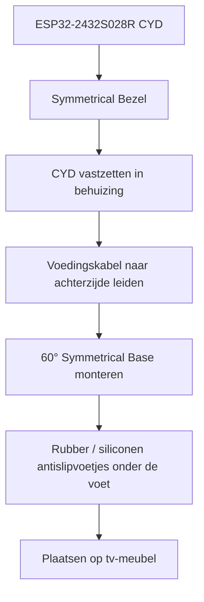

# CYD Home Assistant Dashboard

Een ESPHome + LVGL touchscreen-dashboard voor de **ESP32-2432S028R (Cheap Yellow Display / CYD)** met Home Assistant.

Deze publieke template bevat **geen persoonlijke Wi-Fi-gegevens, wachtwoorden of Home Assistant entity-ID's**. Alle installatie-specifieke gegevens staan via `!secret` in `secrets.yaml`, en dat bestand wordt door `.gitignore` buiten GitHub gehouden.

## Functies

- Weerpagina met temperatuur, gevoelstemperatuur, luchtvochtigheid, wind, luchtdruk en windrichting.
- Verlichtingspagina met 4 lampen.
  - 1× tik: aan/uit.
  - 2× tik: dimmer-popup.
  - Eén RGB-lamp krijgt extra kleurknoppen en **2400 K warm wit**.
- Huispagina met voordeur-slot, woonkamer-temperatuur en wasmachine.
- Wasmachine-popup opent automatisch wanneer de machine start en toont programma, temperatuur en resterende tijd.
- Muziek/radiopagina met 6 zenders.
  - NPO 3FM wordt rechtstreeks via TuneIn gestart.
  - De overige zenders gebruiken configureerbare Home Assistant `button`-entities.
- Audio-pagina met volume-slider, volume +/−, mute, play/pauze en stop.
- De audio-pagina blijft open zolang de mediaspeler daadwerkelijk afspeelt.
- Na 1 minuut inactiviteit keert het dashboard terug naar de hoofdpagina.
- Gast-Wi-Fi QR-code popup.
- Groen/rood HA-verbindingsbolletje.
- Automatische displayhelderheid.
- 180° LVGL-rotatie voor de gebruikte bureaubehuizing.

## Hardware

- ESP32-2432S028R / ESP32-2432S028 CYD
- 2.8 inch ILI9341, 320×240
- XPT2046 resistive touch
- ESPHome 2026.x met LVGL
- Home Assistant met ESPHome-integratie

### Foto van het CYD-bord



> Zet je eigen foto in de map `docs` en noem het bestand **`cyd-board.jpg`**.
> Daarna wordt de foto automatisch hierboven in GitHub weergegeven.

## 3D-geprinte behuizing

Voor dit project is de **CYD Desk Buddy**-behuizing gebruikt.

- **Model:** CYD Desk Buddy for Bambu Lab / Home Assistant
- **Bron / download:** https://makerworld.com/nl/models/2787810-cyd-desk-buddy-for-bambu-lab-home-assistant#profileId-3099382
- **Gebruikte uitvoering:** Symmetrical Bezel + 60° Symmetrical Base
- **Materiaal van deze build:** PETG
- **Laaghoogte:** 0,20 mm
- **Infill:** 15% gyroid
- **Nozzle:** 0,4 mm

De originele 3D-bestanden en het actuele printprofiel blijven bij de maker op MakerWorld. Zo wordt altijd naar de oorspronkelijke bron verwezen en kunnen gebruikers daar de nieuwste STL/3MF-bestanden downloaden.

### Opbouw / bouwtekening



### Montage in het kort

1. Print of bestel de **Symmetrical Bezel** en **60° Symmetrical Base** van de MakerWorld-pagina.
2. Plaats het CYD-bord voorzichtig in de bezel zonder druk op het display uit te oefenen.
3. Leid de voedingskabel zo dat er geen trekkracht op USB of soldeerpunten komt.
4. Monteer de 60° basis.
5. Plak kleine rubberen of siliconen antislipvoetjes onder de basis zodat de Desk Buddy niet over het meubel schuift.
6. Flash daarna `cyd-ha-dashboard.yaml` en controleer touch, schermrotatie en Home Assistant-verbinding.

> De vorm en maatvoering van de behuizing zijn eigendom van de oorspronkelijke MakerWorld-maker. Deze repository bevat daarom geen kopie van diens STL/3MF-bestanden; gebruik de originele downloadlink hierboven.

## Bestanden

| Bestand | Doel |
|---|---|
| `cyd-ha-dashboard.yaml` | Het complete ESPHome-dashboard |
| `secrets.yaml.example` | Voorbeeld van alle benodigde eigen waarden |
| `.gitignore` | Voorkomt dat `secrets.yaml` en buildbestanden op GitHub komen |
| `CHANGELOG.md` | Wijzigingsgeschiedenis |

## Installatie

1. Download of clone deze repository.
2. Maak een kopie van `secrets.yaml.example` en noem die **`secrets.yaml`**.
3. Vul in `secrets.yaml` je eigen Wi-Fi, Home Assistant entity-ID's en radio-button entities in.
4. Controleer bovenaan `cyd-ha-dashboard.yaml` de zichtbare namen van de vier lampen en de mediaspeler.
5. Voeg `cyd-ha-dashboard.yaml` toe aan ESPHome Device Builder of plaats de bestanden in je ESPHome-configuratiemap.
6. Valideer en installeer de YAML op de CYD.
7. Voeg het apparaat in Home Assistant toe via de ESPHome-integratie.

> **Belangrijk:** commit of upload `secrets.yaml` nooit naar een openbare repository.

## API-encryptie

De template werkt standaard zonder een vooraf ingevulde encryptiesleutel, zodat je hem eerst eenvoudig kunt configureren. Na de eerste succesvolle installatie is het aan te raden ESPHome API-encryptie in te schakelen.

In `cyd-ha-dashboard.yaml` staat bij `api:` al een uitgecommentarieerd voorbeeld:

```yaml
api:
  # encryption:
  #   key: !secret api_encryption_key
```

Genereer de sleutel bijvoorbeeld via **ESPHome Device Builder → Native API → Enable encryption**, zet de sleutel in je lokale `secrets.yaml`, haal vervolgens de `#` voor `encryption` en `key` weg en flash opnieuw.

## Home Assistant entity's aanpassen

Alle persoonlijke entity-ID's zitten in `secrets.yaml`. Voorbeeld:

```yaml
media_player_entity: "media_player.your_media_player"
light_living_room: "light.living_room"
front_door_lock_entity: "lock.front_door"
washing_machine_remaining_time_entity: "sensor.washing_machine_remaining_time"
```

De namen die op het scherm verschijnen kun je bovenaan `cyd-ha-dashboard.yaml` aanpassen:

```yaml
light_living_room_name: "Woonkamer"
light_kitchen_name: "Keuken"
light_office_name: "RGB lamp"
light_dressoir_name: "Lamp 4"
media_player_name: "MEDIA"
```

## Radio

NPO 3FM wordt in de YAML rechtstreeks via `media_player.play_media` en TuneIn gestart.

Voor Radio 538, Qmusic, Veronica, Bingo FM en Sterren NL verwacht de template Home Assistant `button`-entities. Vul jouw eigen button-entities in `secrets.yaml` in. Die button kan bijvoorbeeld een Home Assistant-script starten dat de gewenste stream op je mediaspeler afspeelt.

## Updates

Als je later iets aan het dashboard verandert:

1. pas lokaal `cyd-ha-dashboard.yaml` aan;
2. test/valideer eerst in ESPHome;
3. bekijk de wijziging in GitHub Desktop;
4. maak een korte commit, bijvoorbeeld `Add washing machine popup`;
5. klik **Push origin**.

Zo blijft GitHub automatisch je volledige wijzigingsgeschiedenis bewaren.

## Privacy-check vóór publiceren

Controleer vóór iedere push minimaal:

```text
secrets.yaml                 mag NIET mee
Wi-Fi wachtwoorden           mogen NIET in YAML/README staan
API encryption key           mag NIET in YAML/README staan
persoonlijke entity-ID's     horen in secrets.yaml
IP-adressen/tokens           niet publiceren
```

## Credits

Dit dashboard is verder ontwikkeld op basis van het MIT-gelicentieerde project **`timsouth94/cyd-ha-dashboard`**. Dank aan de oorspronkelijke maker voor de CYD/ESPHome/LVGL-basis.

Original project: https://github.com/timsouth94/cyd-ha-dashboard

Verder dank aan ESPHome, LVGL en de ESP32-2432S028R community.

## Licentie

Deze repository gebruikt de MIT License. Zie `LICENSE`. Zie ook `THIRD_PARTY_NOTICES.md` voor de basis waarop dit project verder is gebouwd.
